En este documento se ensuentra la solución del parcial 1:   
Punto 1:   
Nombre: Andrés Felipe Pérez Belalcazar   
Código: A00056964   
   
Punto 3:   
Para validar la imagen    
1) Una vez descargada (el link de descarga es: https://www.debian.org/distrib/netinst#smallcd), 
debemos acceder a: https://cdimage.debian.org/debian-cd/current/amd64/iso-cd/MD5SUMS para poder ver el checksum de lo que hemos descargado.   

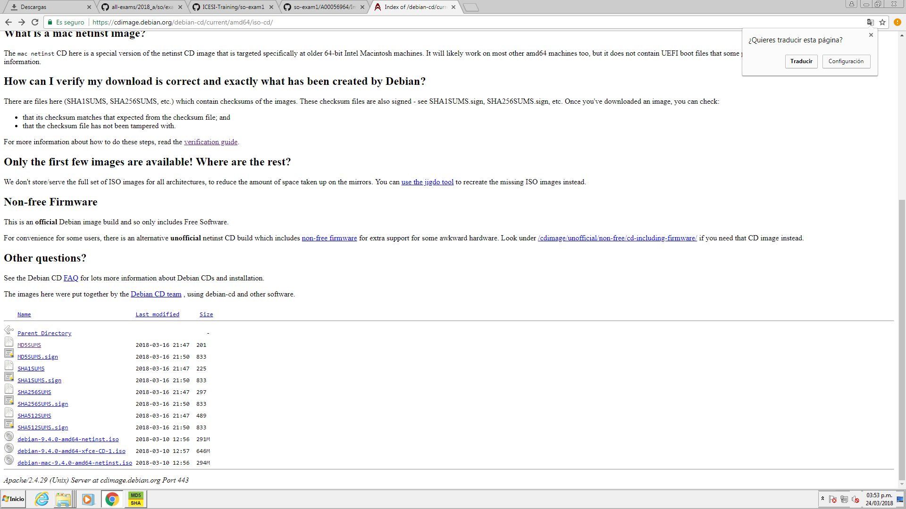

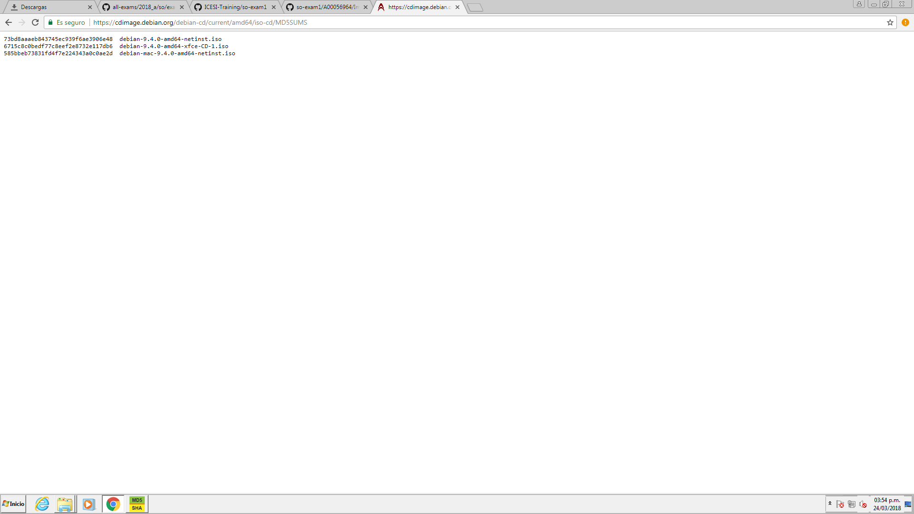

2) Descargamos el programa que obtendra el checksum de la imagen descargada, lo obtenemos de: http://download.cnet.com/MD5-SHA-Checksum-Utility/3001-2092_4-10911445.html lo ejecutamos y elegimos la imagen de debian que hemos descargado en el campo "File". El programa automáticamente generará el MD5 y los SHA (utilizados para encriptar). 

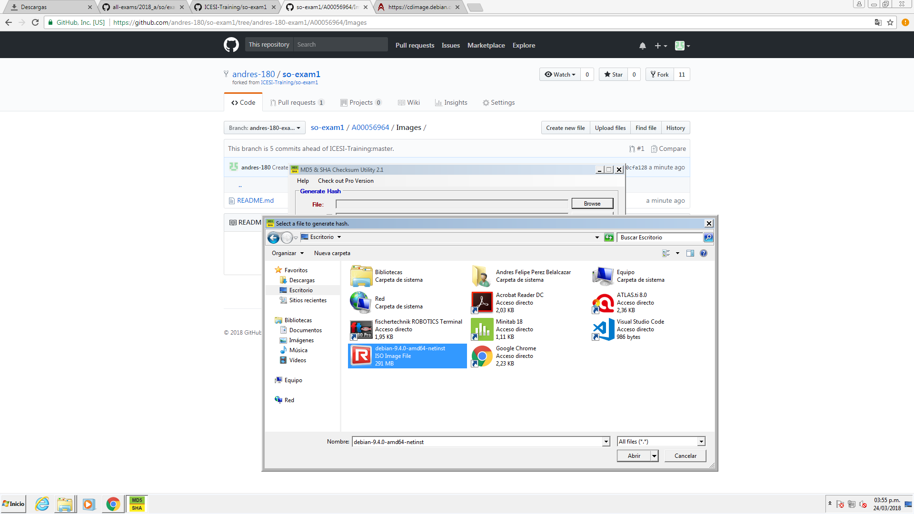

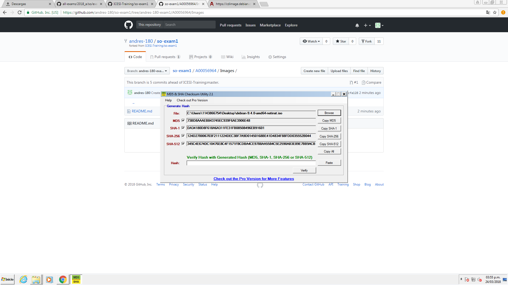

3) En el campo "Hash" pegamos el checksum obtenido en el paso 1, en nuestro caso es el codigo que esta al lado del campo "debian-9.4.0-amd64-netinst.iso"  
4) Hacemos clic en verify y nos aparecerá un cuadro de dialogo confirmando que la imagen es correcta o lo contrario.

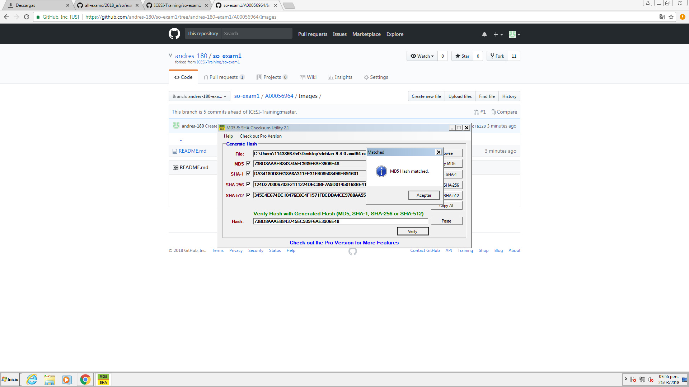

Punto 4:
Instalación de debian 9 e información del SO
1) Abrimos el programa VirtualBox y damos clic en la opción "Nueva".
2) Configuramos el nombre, tipo y versión de SO a instalar (en este caso es Linux, Debian) y damos clic en "Siguiente"
3) Asignamos la cantidad de RAM a usar, en mi caso elegí 4GB y damos clic en "Siguiente".
4) Damos clic en "Crear".
5) Damos clic en "siguiente".
6) Elegimos el tipo de almacenamiento que deseamos, dinámico (recomendado) o fijo. En cualquiera de los dos casos le asignamos un espacio en disco y damos clic en crear.
7) Procedemos a iniciar la máquina Debian, para esto en Virtualbox damos clic en "iniciar" y luego debemos elegir la imagen de la Debian para poder arrancar la instalación del SO.
8) A continuación configuramos el idioma regional y del teclado (en mi caso español para ambos) y damos clic en "Continuar".
9) Luego nos pedirá un dominio de red, lo podemos dejar en blanco y damos clic en "Continuar".
10) En el campo "clave del superusuario" escribimos la contraseña de root que el el usuario principal que utiliza Linux, la confirmamos y damos clic en "Continuar". 
11) Creamos un nuevo usuario, de damos un nombre y una contraseña, damos clic en continuar y esperamos a que realize las connfiguraciones pertinentes.
12) Nos aparecerá la ventana de particionamiento de discos, en esta parte se encuentras varias opciones, seleccionamos "Instalación guiada" - uso completo del disco y damos clic en "Continuar".
13) A continuación damos clic en las siguientes opciones por defecto hasta llegar a la vista de la información de las particiones, seleccionamos la deseada (en mi caso la física) y damos clic en "Siguiente". El sistemas nos preguntara si deseamos escribir los cambios en en disco asi que seleccionamos "Si" y damos clic en continuar. El sistema continuará configurando el volumen.
14) Nos pedirá que configuremos la unidad de CD/DVD, en mi caso no lo deseo hacer, asi que elegimos la opción "No" y damos clic en "Continuar".
15) En la ventana "Configurar el gestor de paquetes" selecionamos "Colombia" y elegimos un mirror de los que aparecen disponibles. Damos clic en "Continuar".
16) Damos clic en "Continuar" si no deseamos configurar el proxy y esperamos a que terminen las configuraciones.
17) Nos preguntara accerca de una encuesta sobre los paquetes, seleccionamos "No" (a menos que la quiera hacer) y damos clic en "Continuar".
18) A continuación apareceran una lista de paquetes adicionales que se pueden instalar (son opcionales) en mi caso selecciono "SSH server" que posiblemente sea usado más adelante y damos clic en "Continuar".
19) Esperamos a que las configuraciones terminen (este proceso puede tardar un poco).
20) A continuación se solicitará instalar GRUB boot debido a que es el único sistema operativo en el disco duro. Aceptamos la instalación presionando "Si" y damos clic en "Continuar".
21) Seleccionamos el disco duro que aparecerá en la lista y damos clic en "Continuar" y el sistema continuará con las configuraciones.
22) El sistema nos avisará que la instalación fue exitosa y damos clic en "Continuar" para reiniciar el sistema.
21) Accedemos con el usuario que creamos y en el menú "Actividades" buscamos "Terminal", usamos los comandos 

```console
operativos@debianA: uname -a
operativos@debianA: uname -r
```
 y otros para ver los datos del sistema.

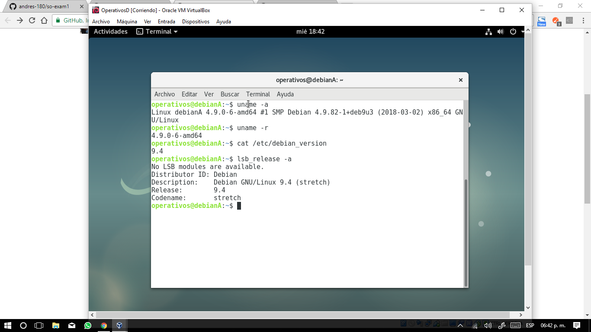

Punto 5:
1) Apagamos la máquina debian y en Virtualbox damos clic en la opción "Configuración", allí seleccionamos la opción "Red", seleccionamos "Adaptador 1" y cambiamos el campo "Conectado a" por "Adaptador puente", configuramos el puerto al cual se conectará (en mi caso WIFI) y damos clic en aceptar.  

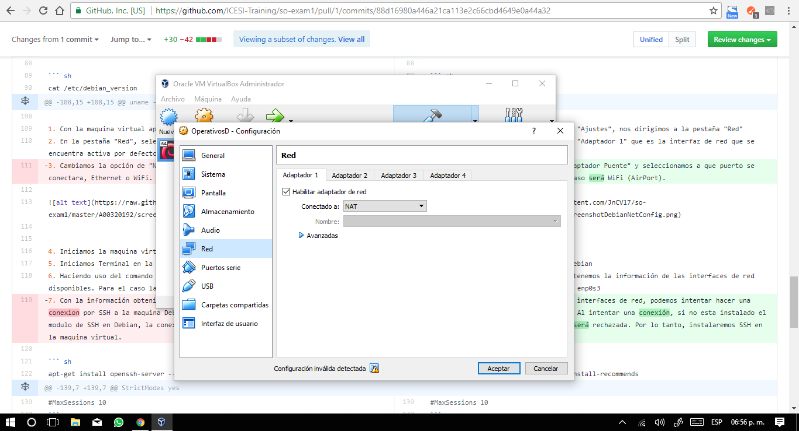

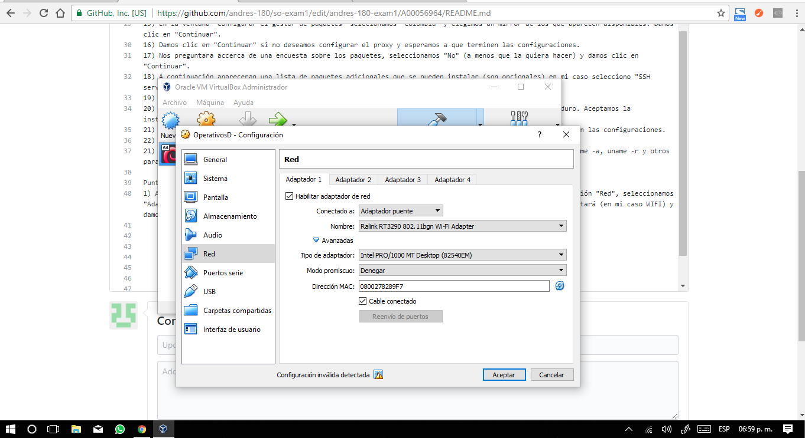

2) Iniciamos la máquina y abrimos una terminal, podemos ver la información de las interfaces con el comando 
```console
operativos@debianA: ip a
```
En este caso nuestra interfaz de interés es la enp0s3.
3) Descargamos Putty de la página: https://www.chiark.greenend.org.uk/~sgtatham/putty/latest.html y lo instalamos (se hace esto porque mi anfitrión es windows). Ejecutamos Putty y en el campo "Host name" colocamos la ip de la interfaz enp0s3, 

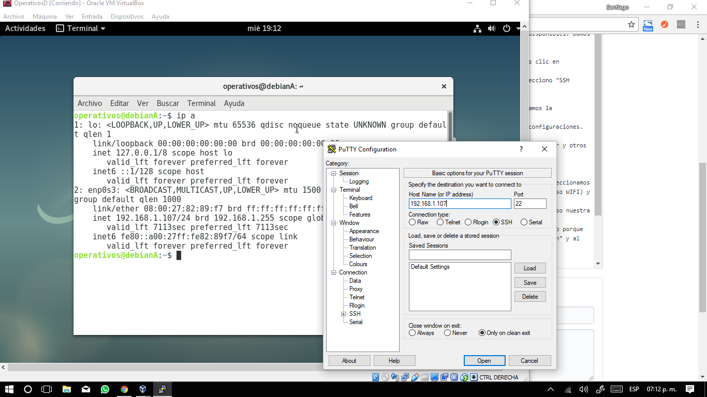

damos clic en "Open" y al mensaje que nos aparecerá damos clic en "Si", por último escribimos nuestro usuario y password de la máquina debian. De este modo ya hemos realizado SSH a debian.


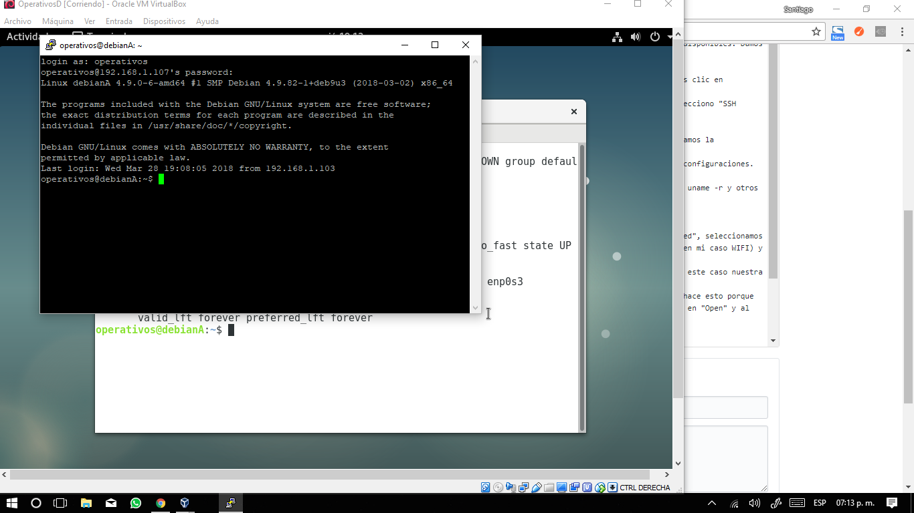

Punto 6:
1) Para instalar git por medio de una terminal o usando SSH digitamos el comendo 
```console
operativos@debianA: apt-get install git
```
Es importante usar el usuario root ya que en mi caso mi usuario creado no tenia ciertos peremisos y no se podia instalar git desde ese usuario. Para acceder al root solo escribimos el comando 
```console
operativos@debianA: su
```
Y escribimos el password de root. A continuación estaremos como root y podremos instalar git sin problemas.


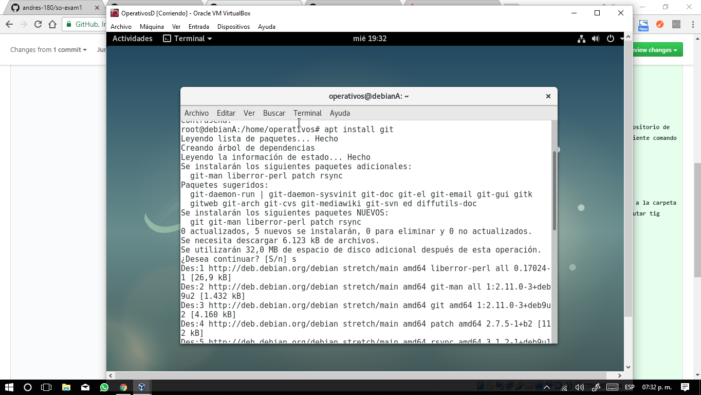

2) Para instalar tig escribimos el comando 
```console
operativos@debianA: cd /tmp/
```
Para elegir ese directorio como el que contendrá los archivos de tig. Conamos el repositorio que contiene tig usando el comando
```console
operativos@debianA: git clone https://github.com/jonas/tig.git
```
Adicionalmente podemos instalar el compilador de C haciendo uso de los comandos 
```console
operativos@debianA: cd tig
operativos@debianA: apt-get install build-essential
operativos@debianA: apt-get install libncurses5-dev libncursesw5-dev
operativos@debianA: make
operativos@debianA: make install
```


La evidencia de los commits se ve a continuación


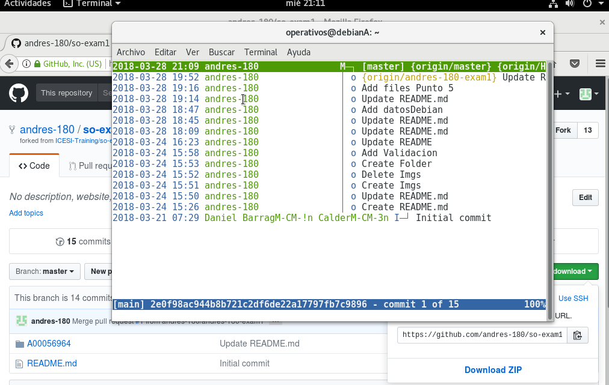

Punto 7:
1) Una vez apagada la máquina ejecutamos Virtualbox y damos clic en "Archivo" y luego en "Exportar servicio virtualizado" y alli nos aparecerá la máquina debian, la elegimos y damos clic en "Next".

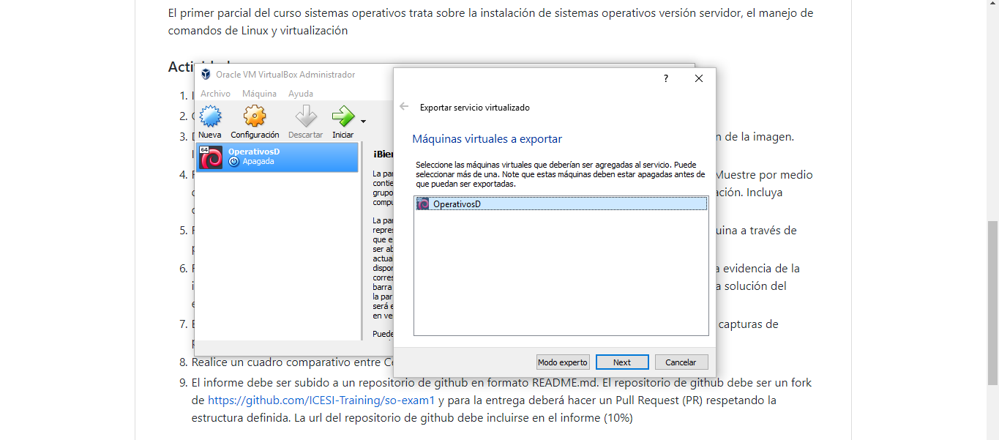

2) Elegimos la ubicación donde la vamos a guardar y damos clic en "Next".

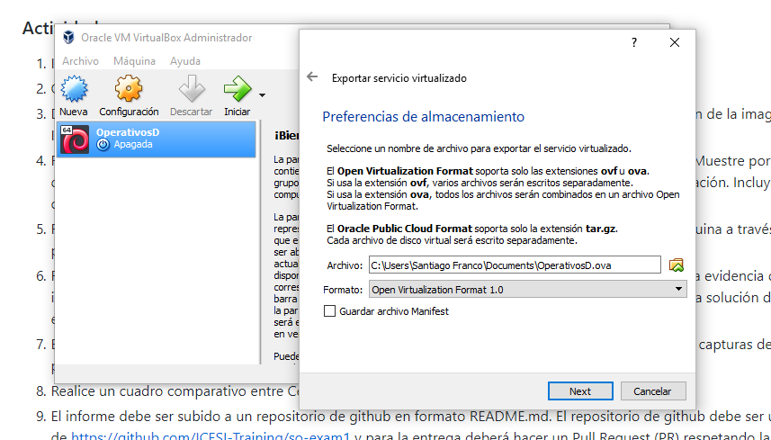

3) Nos apareceran algunos datos de la máquina y damos clic en "Exportar", se comenzará con este proceso que puede tardar unos minutos.

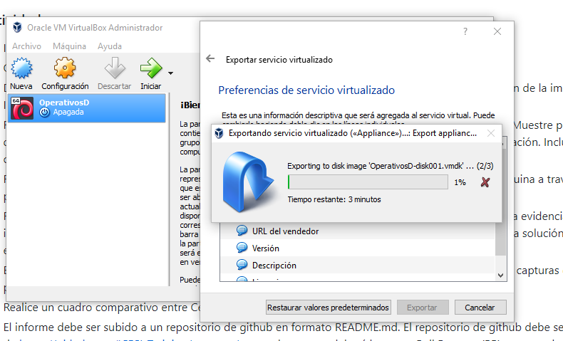

Al final tendremos un archivo "ova" que repŕesenta la máquina exportada.
4) Para importar la máquina en la sala 202C ingresamos a virtualbox y damos clic en la pestaña "Archivo" y elegimos la opción "Importar servicio virtualizado".
5) Buscamos la ubicación del archivo a importar (la máquina) y damos clic en "Abrir".
6) A continuación nos aparecerá la ruta de la debian y damos clic en "Siguiente".
7) Nos aparecerán los datos de la debian y damos clic en "Siguiente".
8) En virtualbox ya nos aparecerá la máquina debian.


